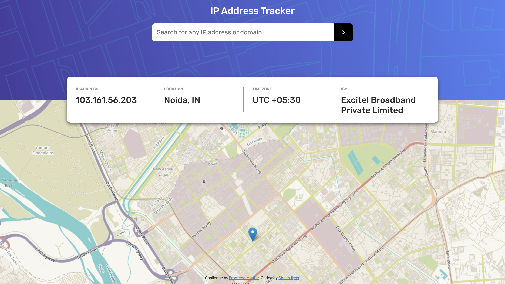
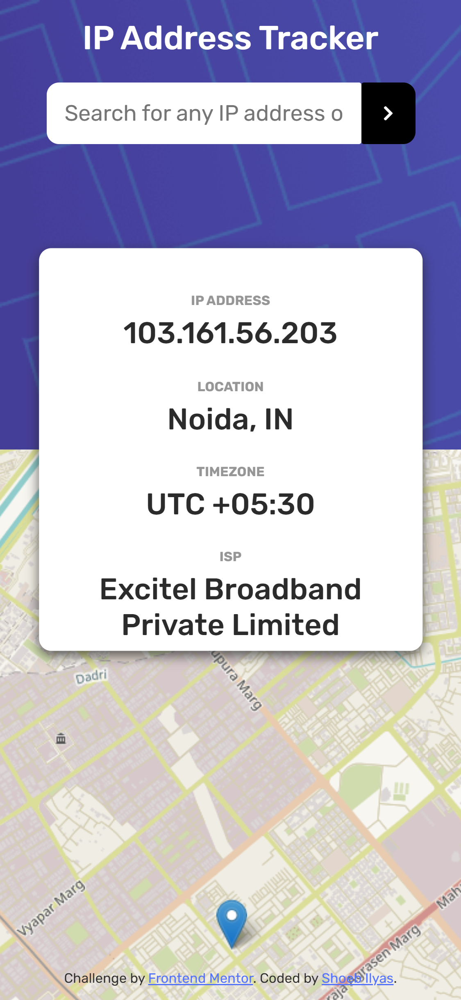

# Frontend Mentor - IP address tracker solution

This is a solution to the [IP address tracker challenge on Frontend Mentor](https://www.frontendmentor.io/challenges/ip-address-tracker-I8-0yYAH0). Frontend Mentor challenges help you improve your coding skills by building realistic projects.

## Table of contents

- [Overview](#overview)
  - [The challenge](#the-challenge)
  - [Screenshot](#screenshot)
  - [Links](#links)
- [My process](#my-process)
  - [Built with](#built-with)
  - [Useful resources](#useful-resources)
- [Author](#author)
- [Acknowledgments](#acknowledgments)

**Note: Delete this note and update the table of contents based on what sections you keep.**

## Overview

### The challenge

Users should be able to:

- View the optimal layout for each page depending on their device's screen size
- See hover states for all interactive elements on the page
- See their own IP address on the map on the initial page load
- Search for any IP addresses or domains and see the key information and location

### Screenshot

### Links

- Solution URL: [Frontendmentor-Solution](https://www.frontendmentor.io/solutions/ip-address-tracker-using-leaflet-and-geoipify-api-zXbfPD5NZ)
- Live Site URL: [Netlify-Live Site](https://shoebilyas-ipaddresstracker.netlify.app/)

## My process

### Built with

- Semantic HTML5 markup
- CSS custom properties
- Flexbox
- [Leaflet API](https://leafletjs.com/) - For rendering maps
- [Geo Ipify API](https://geo.ipify.org/) - For finding location using IP address

### Useful resources

- [Leaflet API Documentation](https://leafletjs.com/reference-1.7.1.html) - The official documentation page of Leaflet API, which I used for maps. It is a great reference for those who have just started with maps in javascript.

## Author

- Website - [ShoebIlyas-LinkedIn](https://www.linkedin.com/in/shoeb-ilyas-6754aa1b6/)
- Frontend Mentor - [@shoebilyas123](https://www.frontendmentor.io/profile/shoebilyas123)
- Twitter - [@shoebilyas3](https://www.twitter.com/shoebilyas3)

## Acknowledgments

I am extremely impressed by the work that front-end mentor is doing. It helps us, new web-developers to put our skills to test by building websites. It helps us apply what we have learnt and eventually become better at what we do.
